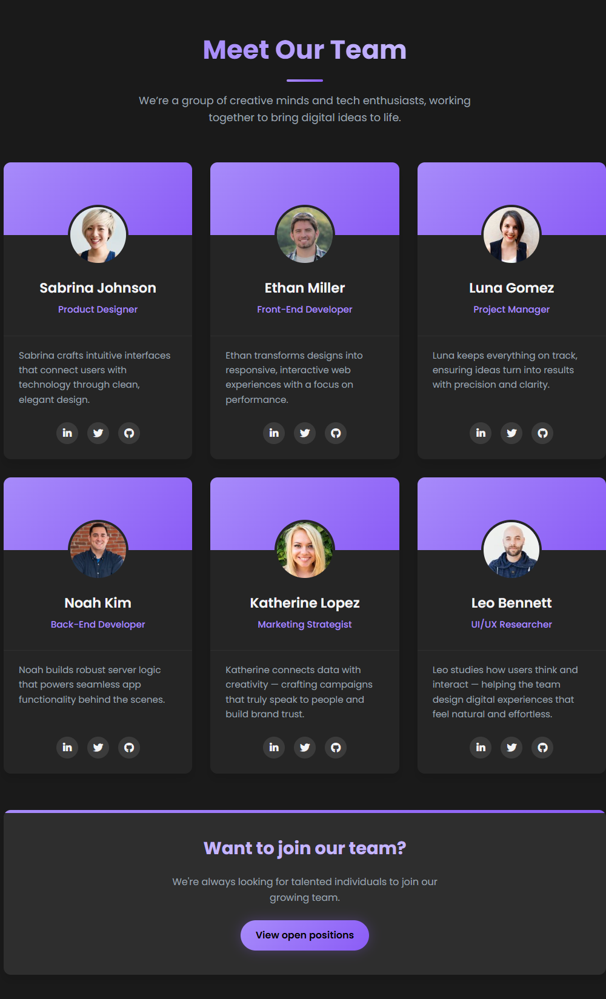

# 👩‍💻 Team Members Showcase

A modern and responsive **team showcase section** built using **HTML and CSS**.  
It features gradient accents, smooth hover animations, and a clean dark aesthetic — perfect for portfolios, company websites, and creative agencies.

---

## 🚀 Live Preview
🔗 [View Live Demo](https://laibatariq110.github.io/team-members-showcase/)

---

## 🖼️ Screenshot

---

## ✨ Features
- Responsive grid layout that adapts to all screen sizes  
- Gradient accents and animated hover effects  
- Smooth transitions with shadow depth  
- Team profiles with avatars and social icons  
- Clean and elegant dark theme  

---

## 🛠️ Built With
- **HTML5**
- **CSS3**
- **Font Awesome Icons**
- **RandomUser API** (for profile images)

---

## 📄 License
This project is open for use and modification — feel free to customize it for your own portfolio or website.

---

